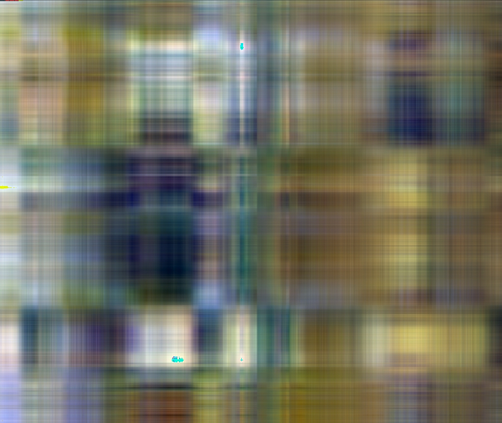
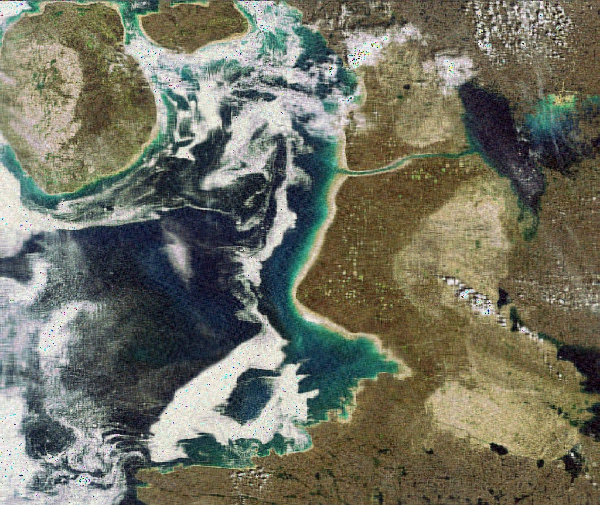

```{r setup, include=FALSE}
knitr::opts_chunk$set(echo = TRUE)
```

This document contains the answered questions of exercise 4 of the course "Multivariate Statistics".

***

# Principal Component Analysis (PCA)

## 1. install and load the packages - load and summerize the data
```{r}
# import necessary libraries
library(ISLR)

# load data
data(OJ)

# explore data
help(OJ)
head(OJ)
str(OJ)
summary(OJ)

# convert categorical variables to factors
OJ$StoreID<-as.factor(OJ$StoreID)
OJ$STORE<-as.factor(OJ$STORE)
OJ$SpecialCH<-as.factor(OJ$SpecialCH)
OJ$SpecialMM<-as.factor(OJ$SpecialMM)
```
The dataset `milk` contains 25 records and 5 attributes. The records represent tree species and all attributes are stored as continuous numbers.
The variables `StoreID`, `STORE`, `SpecialCH` and `SpecialMM` are categorical, hence can be represented as factors.
The variables `StoreID` and `STORE` contain both the Store id the only difference is that Store and are therefore redumdant.


## 2. split data into train and test set
```{r}
# calulate means


```
The variables are directly comparable because they are expressed as percentages (same unit of measurement), hence we do not need to scale the data. Even though the data does not need any scaling, the data matrix has to be centered for computing the PCA.


## 3. LDA
```{r}
# PCA with milk data
pca_milk <- prcomp(x = milk, center = TRUE, scale. = FALSE, retx = TRUE)

# loadings matrix
pca_milk$rotation
```
As we have 5 variables, PCA returns 5 principal components (PC). Examining the loadings matrix we can see that a particular PC describes the most variation for the variables with high absolute values. Therefore, the variables that influence most PC1 are `water` and `fat`. For PC2 this variables are especially `protein`, but also `fat`. In PC3 the most influencing variables are a mixture of `water`, `fat` and `lactose`. PC4 is shaped by `lactose` and PC5 is almost exclusively influenced by `ash`.


## 4. select variables for predicting 
```{r}
# scores matrix
pca_milk$x
```
The PCA basically maps the data points to a different coordinate system (where the variance is maximized). The scores in this matrix show where the data points lie on the new axes. If we take for example the data point `HORSE` with the value *-15.7* in the column `PC1`, it means that this data point is mapped onto the value *-15.7* on the new principal component axis `PC1`.


## 5. LDA
```{r}
# summary method
summary(pca_milk)
```
The first PC (`PC1`) explains 96.7% of the variance of the data. If we look at the second PC (`PC2`), we can see that `PC2` just explains 2.8% of the variance and the consecutive PCs (`PC3` to `PC5`) explain just a minimal fraction of the variance. Due to the high proportion of variance of `PC1`, it is sufficient to choose just this PC for further computation.


## 6. score plot and a loadings plot
```{r}
library(shape)
# score plot
plot(pca_milk$x[, 1:2], pch = 19,
xlab = "PC1", ylab = "PC2", main = "Score Plot")
# loading plot
plot(pca_milk$rotation[, 1:2], pch = 19,
xlab = "PC1", ylab = "PC2", main = "Loading Plot")
# Arrows (shape package required)
Arrows(x0 = 0, y0 = 0, x1 = pca_milk$rotation[, 1],
y1 = pca_milk$rotation[, 2], arr.adj = 1, col = "red")
# show zero lines
abline(h = 0, col = "grey")
abline(v = 0, col = "grey")
# variable names
text(pca_milk$rotation[, 1:2], labels = rownames(pca_milk$rotation))
```


## 7. biplot
```{r}
# biplot
biplot(pca_milk, main = "Biplot", cex = c(0.5,1), scale = 0)
```
The biplot is the combination of the score plot and the loadings plot. It shows on the one hand the variable loadings (red vectors) in the space of `PC1` and `PC2` and on the other hand the data records and maps them into the space of `PC1` and `PC2`. For example we can see that the vector `fat` points in the upper right corner, therefore the most right data points (`SEAL` and `DOLPHIN`) are also the ones with the highest fat content. Similarly we can interpret that the data point `RABBIT` should have the highest protein content because it is the lowest data point and the `protein` vector is pointing down.


## 8. cluster data
```{r}
# calculate k-means
km <- kmeans(as.matrix(milk), centers=4)

# biplot
biplot(pca_milk, main = "Biplot", cex = c(0.5,1), scale = 0, xlabs=km$cluster)
```

***

# PCA for Dimensionality Reduction

## 9. load photo
```{r}
# load package
require(jpeg)

# load photo
photo <- readJPEG("Foxe_Basin_Canada.jpg")

nrow(photo)
ncol(photo)

# dimensions / resolution
dim(photo)

# class of object photo
class(photo)

# create matrices for every channel
r <- photo[,,1]
g <- photo[,,2]
b <- photo[,,3]

# preform PCA on data
r.pca <- prcomp(r, center = F)
g.pca <- prcomp(g, center = F)
b.pca <- prcomp(b, center = F)
rgb.pca <- list(r.pca, g.pca, b.pca)
```
interpret results


## 10. apply PCA compression on photo
```{r}

for (i in seq.int(3, round(nrow(photo)/5), length.out = 20)) {
pca.img <- sapply(rgb.pca, function(j) {
compressed.img <- j$x[,1:i] %*% t(j$rotation[,1:i])
}, simplify = 'array')
writeJPEG(pca.img, paste('PIC_', round(i,0), '_components.jpg', sep = ''),
quality=1)
}
```
As expected the lower the PCs used the lower the quality of the image. With 3 PCs the image is not recognizable, however with just 12 PCs shapes are already recognizable although the image quality is very low. With 57 PCs the quality improved drastically however there is still a quality deficit. When using more than 100 PCs the quality difference is much harder recognizable and can be considerd satisfactory.


## 11. include photo
Picture compressed with 3 numbers of principal components  

\pagebreak

Picture compressed with 101 numbers of principal components  

  
***